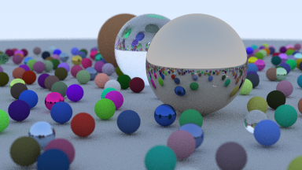

Ray Tracing in One Weekend
=
A Rust implemenation of the code from the book [Ray Tracing in One Weekend](https://raytracing.github.io/books/RayTracingInOneWeekend.html)




Running the code will generate a scene with random spheres similar to the above image.

## Generating an Image
First clone the repo.

Build by running the command:
```
cargo build --release
```
The path to the executable is `./target/release/rtow`

The output is printed to Stdout as a [PPM Image](http://netpbm.sourceforge.net/doc/ppm.html). The output can be redirected to a file like so:
```
rtow > filename.ppm
```